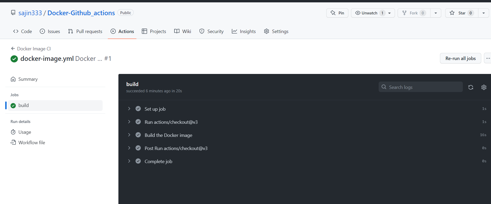
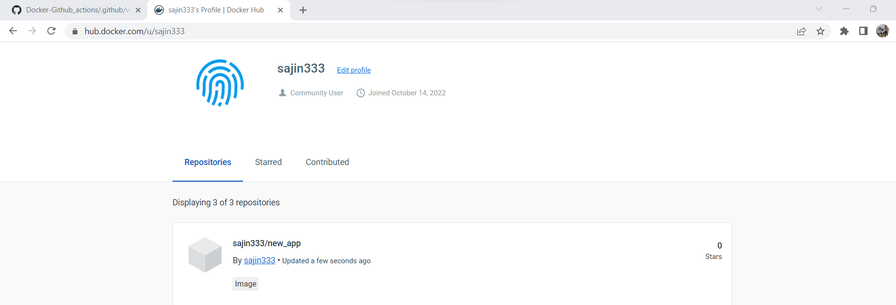

# Docker-Github_actions
# Building Docker Image using Github_actions (docker_image.yml is used)

Step 1 – Create a Github repository 
Step 2 – Commit a Dockerfile to Github repository 
Step 3 – Select a Github action workflow 
Step 4 – Save the new Github action workflow 
Step 5 – Make a change in the Dockerfile and trigger a Docker image build 

# Pusing Docker Image to Dockerhub using Github_actions (containers.yml is used)
Peform changes in the yml configuration file 

Image pushed to Dockerhub using Github Actions

